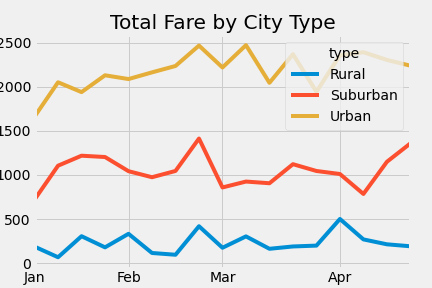

# PyBer_Analysis

## Overview of Project
Create a summary DataFrame of the ride-sharing data by city type. Then, using Pandas and Matplotlib, create a multiple-line graph that shows the total weekly fares for each city type.

## Results
These are the results from the ride-sharing summary by city type:

* Rural
    * Total Rides: 125
    * Total Drivers: 537
    * Total Fares: $4,327.93
    * Avg Fare per Ride: $34.62
    * Avg Fare per Driver: $8.06
* Suburban
    * Total Rides: 625
    * Total Drivers: 8570
    * Total Fares: $19,356.33
    * Avg Fare per Ride: $30.97
    * Avg Fare per Driver: $2.26
* Urban
    * Total Rides: 1625
    * Total Drivers: 59602
    * Total Fares: $39,854.38
    * Avg Fare per Ride: $24.53
    * Avg Fare per Driver: $0.67

This is the multiple-line chart of total fares for each city type:

## Summary
Here are three business recommendations for addressing disparities among the city types:

1. The Rural type has the fewest drivers and rides, but the highest average fare.
2. The Urban type has the highest number of drivers and rides, but the lowest average fare.
2. The Suburban type data is between Rural and Urban for all data points. 